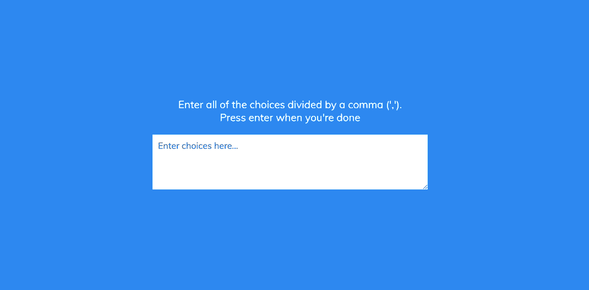

# 🎯 RandomChoicePicker

This is a simple and fun **Random Choice Picker** built using **HTML**, **CSS**, and **JavaScript**.  
It allows users to input a list of options, and it randomly picks one with a smooth animation! 🎲

---

## 🎥 Demo

<p align="center">
  
</p>

---

## ✨ Features

-  Enter any number of comma-separated options  
-  Smooth highlight animation that cycles before choosing  
-  Randomly selects one option from the list  
-  Minimal, responsive, and user-friendly interface  

---

## 🛠️ Technologies Used

- **HTML** – structure of the picker interface  
- **CSS** – animations and styling  
- **JavaScript** – logic for parsing input and picking randomly  

---

## 📂 How to Use

1. 📥 Clone the repository:
   ```bash
   git clone https://github.com/JehanAB/RandomChoicePicker.git
